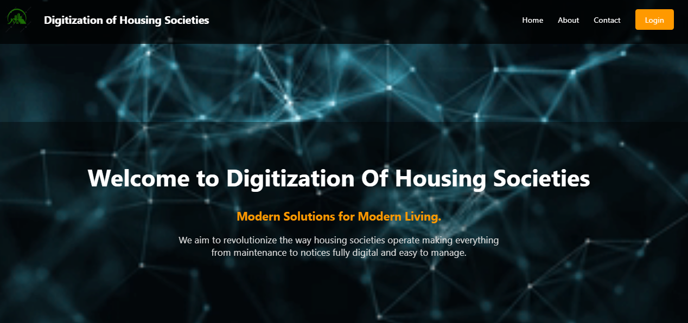
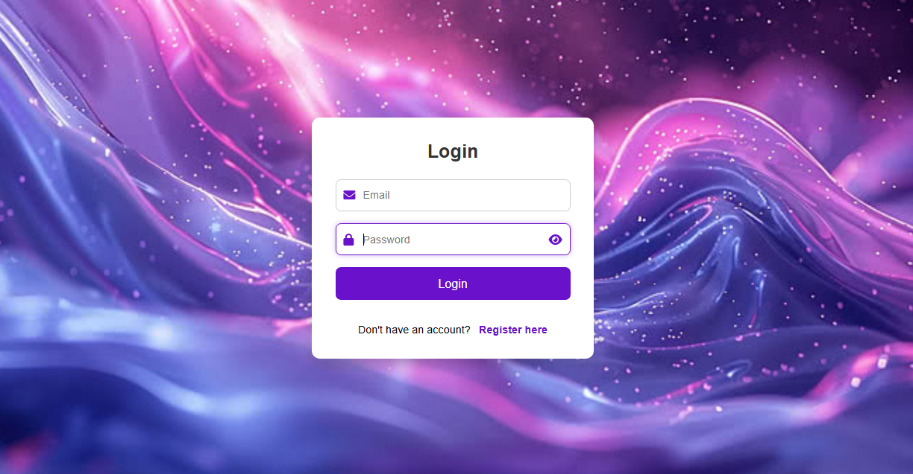
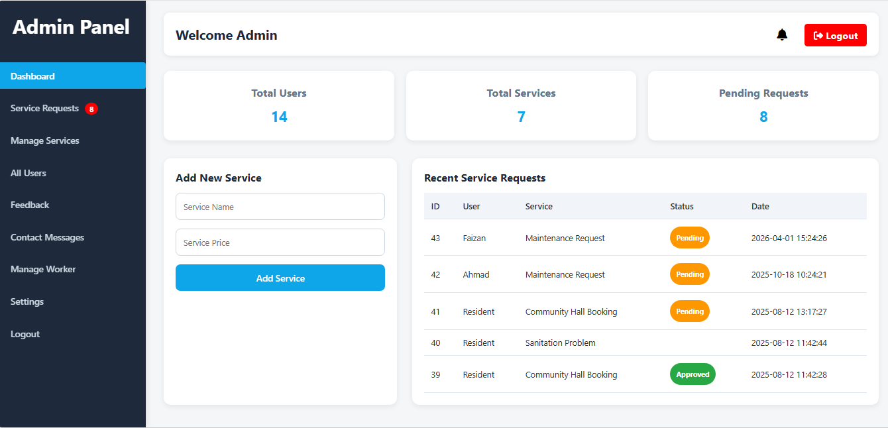
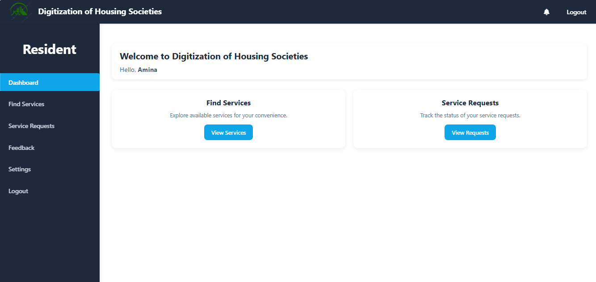

# 🏢 Digitization of Housing Societies

**Modern Solutions for Modern Living.**

A web-based platform designed to digitize and simplify the day-to-day operations of housing societies from maintenance tracking to notices, making society management fully digital and easy to handle for admins, residents, and workers alike.

---

## 📋 Table of Contents
- [About the Project](#about-the-project)
- [User Roles](#user-roles)
- [Screenshots](#screenshots)
- [Security](#security)
- [Core Functionality (CRUD)](#core-functionality-crud)
- [Tech Stack](#tech-stack)
- [Getting Started](#getting-started)
- [Contact](#contact)

---

## 📌 About the Project

Housing societies often rely on manual processes ( registers, notice boards, and phone calls to manage residents, maintenance, and staff). This project aims to **replace these outdated methods with a centralized digital platform**, where every stakeholder (Admin, Resident, and Worker) has a dedicated dashboard tailored to their responsibilities.

The system handles everything from service requests and maintenance tracking to feedback collection and internal communication, all from one unified portal.

---

## 👥 User Roles

The platform supports **three types of users**, each with a distinct dashboard and access level:

| Role | Description |
|------|-------------|
| 🛡️ **Admin** | Manages residents, workers, services, feedback, and service requests raised across the society |
| 🏠 **Resident** | Browses available services, raises service requests, tracks their status, and submits feedback |
| 🔧 **Worker** | Views assigned tasks/duties and updates work status |

Upon login, the system automatically redirects users to the dashboard corresponding to their assigned role, so each user only sees the features relevant to them.

---

## 🖼️ Screenshots

### 1. Home Page

The landing page welcomes visitors with an overview of the platform's purpose. It includes navigation links (**Home, About, Contact**) and a **Login** button for existing users to access their role-based dashboard.



---

### 2. Login Page

Users log in using their registered email and password. New users can navigate to the registration page via the **"Register here"** link. Based on the role assigned during registration, the system authenticates the user and redirects them to their respective dashboard ( Admin, Resident, or Worke)r.



---

### 3. Admin Panel

Once logged in as an **Admin**, the user is greeted with a full-featured dashboard for managing the entire society:

- **Overview cards :** displaying key metrics: Total Users, Total Services, and Pending Requests at a glance
- **Add New Service :** allows the admin to add new services (name and price) that residents can request
- **Recent Service Requests :** a live table showing requests raised by residents, including requester name, service type, status (Pending/Approved), and date
- **Sidebar navigation :** for quick access to Service Requests, Manage Services, All Users, Feedback, Contact Messages, Manage Worker, and Settings

This centralized panel gives the admin full control and visibility over society operations without needing separate tools or manual tracking.



---

### 4. Resident Dashboard

Residents get a simplified, easy-to-use dashboard focused on their needs:

- **Find Services :**  allows residents to explore and browse all services available in the society
- **Service Requests :**  lets residents track the real-time status of requests they've raised (e.g., maintenance, community hall booking)
- **Feedback :**  residents can share their feedback or concerns directly with the admin
- Personalized greeting (e.g., "Hello, Fatima") for a more user-friendly experience

This ensures residents can independently request services and stay updated without needing to contact the admin directly.



---

<!-- Add Worker dashboard screenshot here once available -->

---

## 🔒 Security

- **Password Hashing** : user passwords are never stored in plain text. All passwords are hashed before being saved to the database, ensuring that even in the event of a data breach, user credentials remain protected.
- **Role-Based Access Control (RBAC)** : each user is restricted to their designated dashboard and functionality based on their assigned role (Admin/Resident/Worker), preventing unauthorized access to sensitive features.

---

## 🔄 Core Functionality (CRUD)

The application implements complete **CRUD (Create, Read, Update, Delete)** operations across its major modules, including:

- **Services** : Admin can create, view, update, and remove services offered to residents
- **Service Requests** : Residents can create requests; Admin can view, update status (Pending/Approved), or delete them
- **Users** : Admin can view and manage all registered users (residents/workers)
- **Feedback** : Residents can submit feedback; Admin can view and manage submitted feedback
- **Contact Messages** : Messages submitted through the Contact page can be viewed and managed by the Admin

This ensures the platform is fully dynamic, with real-time data management across all roles.

---

## 🛠️ Tech Stack

- **Frontend:** *(add your stack here, e.g. HTML, CSS, JavaScript, Bootstrap)*
- **Backend:** PHP
- **Database:** MySQL
- **Security:** Password Hashing

---

## 🚀 Getting Started

Follow these steps to run this project on your local machine using **XAMPP**:

1. **Install XAMPP** (if not already installed) from [apachefriends.org](https://www.apachefriends.org/)

2. **Clone the repository** into your XAMPP `htdocs` folder:
```bash
   cd C:/xampp/htdocs
   git clone https://github.com/Emaan-Nawaz/Digitization-of-housing-societies.git
```

3. **Start Apache and MySQL** from the XAMPP Control Panel

4. **Create a database:**
   - Open `http://localhost/phpmyadmin` in your browser
   - Create a new database (e.g. `housing_society_db`)
   - Import the project's `.sql` file (if included in the repo) into this database

5. **Configure the database connection:**
   - Open the project's config file (e.g. `db_connect.php` or `config.php`)
   - Update it with your local database credentials:
```php
     $host = "localhost";
     $username = "root";
     $password = "";
     $database = "housing_society_db";
```

6. **Run the project:**
   - Open your browser and go to: http://localhost/Digitization-of-housing-societies
   ---

## 📧 Contact

For queries or suggestions, feel free to reach out via the Contact page on the platform or open an issue on this repository.